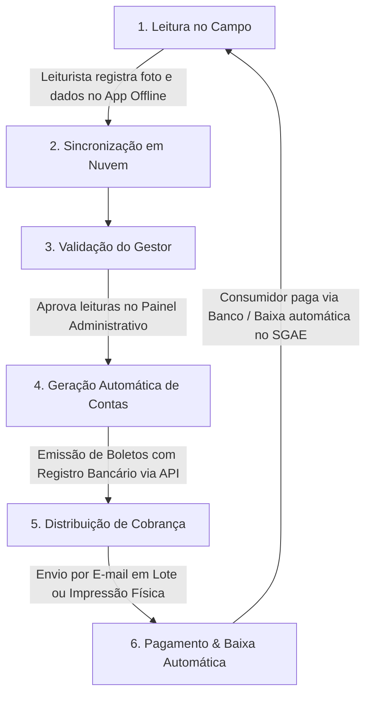

# Briefing Detalhado: SGAE (Sistema de Gestão de Água e Esgoto)

## 1. Informações Gerais
- **Nome do Produto:** SGAE – Sistema de Gestão de Água e Esgoto
- **Responsável/Equipe:** Matheus Pires
- **Desenvolvedora:** Rumo Soluções
- **Data do Briefing:** 20 de Junho de 2025
- **Objetivo do Documento:** Consolidar a visão do produto, mapeamento de mercado, proposta de valor, especificações funcionais e a estrutura estratégica da landing page do SGAE.

---

## 2. Visão Geral do Produto & Proposta de Valor
O SGAE é um sistema completo e integrado projetado para modernizar e digitalizar a gestão administrativa, operacional e financeira de instituições responsáveis pelo controle, distribuição e cobrança de água e esgoto (concessionárias, autarquias municipais, prefeituras e empresas públicas ou privadas).

### Promessa Central
**Digitalizar e automatizar a gestão de cobrança e atendimento de água e esgoto**, oferecendo transparência total para o consumidor final, facilidade de acompanhamento financeiro em tempo real e controle operacional absoluto para a empresa gestora.

### Benefícios Operacionais e Emocionais
*   **Funcionais:**
    *   Redução expressiva de perdas comerciais e operacionais.
    *   Rastreabilidade total das leituras por meio de registro fotográfico e geolocalização.
    *   Otimização inteligente de rotas para os agentes leituristas.
    *   Agilidade no faturamento (emissão e registro automático de boletos no mesmo dia da leitura).
    *   Controle administrativo aprimorado de funcionários e frotas.
*   **Emocionais:**
    *   **Tranquilidade e Conformidade:** Garantia de conformidade com a Lei do Saneamento.
    *   **Redução do Estresse na Gestão:** Eliminação de processos manuais lentos e redução de conflitos com moradores causados por leituras estimadas incorretamente.

---

## 3. Análise de Mercado & Desafios Resolvidos

### Segmento-Alvo
*   Concessionárias de água e esgoto municipais e privadas.
*   Autarquias municipais de saneamento básico (ex: VESAN, AMSJA).
*   Prefeituras que realizam administração direta de serviços essenciais de saneamento.

### Principais Dores Solucionadas pelo SGAE
1.  **Baixo Controle sobre Leituras:** Muitas medições são puladas (portão fechado, agentes ausentes) ou estimadas incorretamente, reduzindo a arrecadação.
2.  **Processos Manuais e Desconexos:** Dependência de papel, anotações de campo manuais e digitação manual em planilhas para a geração de contas.
3.  **Falta de Integração Sistêmica:** Ruptura na comunicação entre quem executa o serviço de campo (leituristas) e quem emite as cobranças financeiras.
4.  **Comunicação Ineficiente com o Cidadão:** Falta de transparência no histórico de consumo e morosidade no envio de faturas e retorno sobre ordens de serviço.

### Diferenciais Competitivos (vs. Concorrentes como COPASA e ERPs Públicos Genéricos)
| Característica | Sistemas Tradicionais / ERPs Genéricos | SGAE (Diferenciais) |
| :--- | :--- | :--- |
| **Precisão das Leituras** | Leituras estimadas ou preenchidas manualmente sem comprovação. | Praticamente 100% das leituras feitas com comprovação por foto e localização GPS. |
| **Tempo de Cobrança** | Grande hiato de dias entre a leitura do consumo e a entrega do boleto. | Geração e emissão do boleto bancário no mesmo dia em que a leitura é efetuada. |
| **Acesso a Dados em Campo** | Necessidade de internet contínua para atualizar dados. | Funcionamento 100% offline no aplicativo dos leituristas, com sincronização automática posterior. |
| **Gestão de Suprimentos** | Controle de materiais e ferramentas descentralizado e informal. | **Almoxarifado Inteligente** integrado para gerenciar hidrômetros, tubos, ferramentas e EPIs. |
| **Atendimento ao Cidadão** | Centrais telefônicas congestionadas ou guichês presenciais lentos. | **Agência Virtual no WhatsApp** integrada para autoatendimento e envio automático de contas. |
| **Suporte Técnico** | Suporte genérico e lento, dependente de consultorias externas. | Equipe técnica especializada, SLA de suporte ágil e atualizações mensais inclusas. |

---

## 4. Estrutura Operacional Ponta a Ponta
O funcionamento do SGAE desenha um fluxo ágil e integrado que conecta o trabalho de campo à contabilidade e ao consumidor final:

1.  **Coleta de Leituras (Leiturista):** O agente em campo insere a leitura no aplicativo do SGAE, sendo obrigatório registrar a foto do hidrômetro. A geolocalização é coletada de forma transparente em segundo plano.
2.  **Envio Automático:** Assim que o app detecta rede móvel ou Wi-Fi, os dados são sincronizados em nuvem.
3.  **Validação (Gestor):** O gestor acessa o painel web administrativo para validar as leituras discrepantes ou aprovar o lote coletado.
4.  **Faturamento e Emissão:** O sistema calcula o consumo com base nas tarifas parametrizadas da concessionária, gera os boletos integrados ao banco e envia por e-mail ou prepara para envio físico.
5.  **Conciliação e Baixa:** Quando o consumidor realiza o pagamento, o banco envia a confirmação e a baixa ocorre de maneira automática no sistema.

---

## 5. Mapeamento de Funcionalidades (Matriz de Recursos)

### Funcionalidades Core (Operacionais e Administrativas)
*   **Gestão de Imóveis e Rotas:** Cadastro e roteirização detalhada de imóveis com cobertura por bairro, logradouro, quadra, lote e pena d'água.
*   **Registro Digital de Hidrômetros:** Coleta offline das leituras com registro de foto do visor e localização GPS de controle.
*   **Faturamento Inteligente:** Cálculo automático de tarifas específicas de saneamento, geração de parcelamento de contas atrasadas e cálculo automático de juros e multas.
*   **Emissão de Boletos em Lote:** Envio de contas em lote por e-mail ou impressão física simplificada para entrega local.
*   **Integração Bancária Direta:** Registro imediato dos boletos e baixa automática no sistema após compensação bancária.

### Funcionalidades Premium (Diferenciais Chave)
*   **Almoxarifado Inteligente:**
    *   Controle detalhado e auditoria patrimonial sobre o estoque de insumos de saneamento (hidrômetros, tubos, conexões, ferramentas e EPIs).
    *   Monitoramento em tempo real de entradas e saídas de materiais, evitando desvios, perdas de estoque e garantindo transparência pública.
*   **Agência Virtual integrada ao WhatsApp:**
    *   Permite que o morador solicite a segunda via do boleto, consulte débitos e consulte seu histórico de consumo de forma automatizada pelo WhatsApp.
    *   Notificações automáticas de falta de água programada ou vazamentos.
*   **Ordens de Serviço Integradas:**
    *   Criação e acompanhamento de Ordens de Serviço (OS) enviadas diretamente ao celular dos técnicos.
    *   Atualização de status com envio de mensagens automáticas de retorno em tempo real para os moradores via WhatsApp.

---

## 6. Estrutura Estratégica da Landing Page (Arquitetura AIDA)
Visando converter leads públicos e privados em demonstrações reais, a estrutura da Landing Page foi estruturada de forma altamente persuasiva:

1.  **Seção Hero (Atenção + Interesse):**
    *   **UpHeadline:** *Sistema Inteligente para gestão de saneamento.*
    *   **Headline Principal (Big Idea):** *"Pare de perder controle sobre leituras e cobranças: digitalize a gestão de água e esgoto com eficiência total"*
    *   **Subheadline:** *"Elimine erros, aumente a sua arrecadação e conquiste de vez a confiança da população com leituras precisas, boletos automáticos e gestão 100% digital."*
    *   **CTA Primário:** ➡️ *Quero conhecer o SGAE agora*
2.  **Bloco de Prova Social e Autoridade (Confiança):**
    *   Destaque para o histórico com autarquias sólidas: **Mais de 10 anos atendendo autarquias como a AMSJA (São José de Almeida)**.
    *   Menção a parcerias de longo prazo, como o caso da **VESAN (Sete Lagoas)**, cliente há mais de 5 anos.
3.  **Apresentação e Fluxo de Operação:**
    *   Explicação simples sobre o funcionamento do app e do painel, guiando o visitante através da rotina diária da autarquia de saneamento.
4.  **Destaque dos Recursos Exclusivos (Almoxarifado e WhatsApp):**
    *   Foco em eficiência operacional, prevenção de desvios patrimoniais (Almoxarifado) e redução dramática do atendimento humano físico através do WhatsApp.
5.  **FAQ e Conversão Final (Ação):**
    *   *O sistema funciona offline?* Sim, garantindo que locais com sinal instável de internet consigam fazer a leitura sem problemas.
    *   *Precisa de servidores internos?* Não, é 100% baseado em nuvem segura, reduzindo custos de TI para a prefeitura ou concessionária.
    *   *CTA Final:* *Fale com um especialista da Rumo Soluções e Solicite uma demonstração gratuita*.

---

## 7. Indicadores de Sucesso (KPIs Esperados)
A implantação do SGAE visa atingir melhorias mensuráveis nos seguintes indicadores de desempenho (KPIs):
*   **% de aumento na arrecadação geral** devido ao fim de leituras estimadas por baixo.
*   **Redução da inadimplência** por facilidade de pagamento (boleto rápido via WhatsApp e código de barras instantâneo).
*   **Tempo médio do ciclo de cobrança** (reduzido para o mesmo dia da leitura).
*   **Redução do custo operacional por leitura** (rotas de leituristas mais ágeis e organizadas).
*   **NPS e satisfação do cidadão** devido à comunicação rápida e transparência tarifária.

---
*Este briefing foi estruturado com base nos documentos internos e manuais da Rumo Soluções, em conformidade com as diretrizes de modernização da gestão pública e padrões ESG.*
