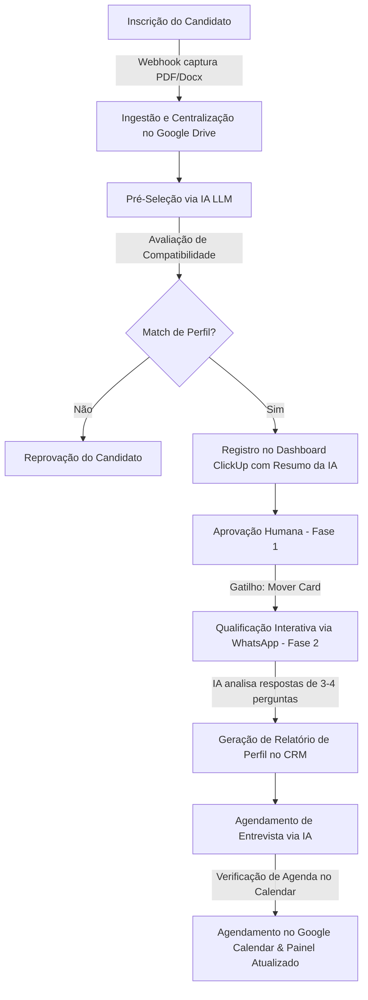

# Briefing Detalhado: Agente de IA para Recrutamento e Seleção (RH) – Rumo AI

O **Agente de IA para RH da Rumo** é um ecossistema de automação inteligente de nível corporativo, projetado para revolucionar e otimizar todas as etapas do funil de recrutamento e seleção (R&S). Desenvolvida sob medida para lidar com altas demandas de candidaturas — como vagas operacionais e administrativas que chegam a receber mais de 500 currículos em um único dia —, a solução atua desde a ingestão do currículo até o agendamento final da entrevista.

O principal valor da solução está no modelo de **parceria híbrida (copiloto)**: a Inteligência Artificial executa o trabalho repetitivo e volumoso de análise de currículos e entrevistas iniciais pelo WhatsApp, enquanto o recrutador humano valida e aprova os candidatos que avançam no funil de forma centralizada e sem perder o controle do processo.

---

## 1. Problemas de Mercado Solucionados

*   **Sobrecarga de Triagem Manual:** Elimina o tempo improdutivo gasto pelo time de RH analisando centenas de currículos individualmente. A IA filtra e qualifica os perfis que realmente atendem aos requisitos em questão de segundos.
*   **Falta de Soberania de Dados (Dependência de Terceiros):** Resolve a dependência de plataformas proprietárias (como LinkedIn, Gupy ou Catho) ao centralizar e organizar todos os currículos em uma base de dados própria (Single Source of Truth), gerando independência e histórico para a empresa.
*   **Candidaturas Duplicadas e Desorganização:** Filtra entradas repetidas no sistema caso o mesmo candidato aplique por diferentes canais para a mesma vaga, limpando e atualizando o contato existente.
*   **Lentidão no Primeiro Contato (Qualificação):** Resolve a demora de dias para iniciar a triagem de comportamento. O sistema inicia a entrevista inicial via WhatsApp de forma instantânea com candidatos pré-aprovados.
*   **Furos de Agendamento e Conflitos de Agenda:** Evita erros humanos comuns, como marcar reuniões em horários ocupados, em feriados ou finais de semana, checando a agenda integrada do recrutador em tempo real.

---

## 2. Funcionamento do Fluxo (A Jornada do Candidato)

O funil funciona em um fluxo orquestrado onde a Inteligência Artificial e a supervisão do gestor de RH alternam responsabilidades de forma fluida:

1.  **Ingestão e Centralização:** O candidato realiza a aplicação. Um webhook intercepta as informações e o arquivo binário (PDF/Docx), armazenando o arquivo de forma estruturada em uma pasta específica do Google Drive.
2.  **Pré-Seleção da IA:** A IA lê o texto contido no currículo e avalia a compatibilidade dele com os requisitos formais da vaga. Caso haja sinergia (*match*), ele é qualificado; caso contrário, é reprovado.
3.  **Registro no ClickUp:** O sistema cria um "card" automatizado no ClickUp (que funciona como o CRM de recrutamento), anexa o currículo original, insere um resumo técnico em tópicos elaborado pela IA e preenche campos personalizados (como nome e WhatsApp higienizado).
4.  **Aprovação Humana (Fase 1):** O gestor de RH visualiza apenas os candidatos pré-aprovados pela IA. Ele revisa os pontos fortes e move o card do candidato para a coluna "Qualificação".
5.  **Qualificação via WhatsApp (Fase 2):** A movimentação do card dispara um gatilho de conversa interativa via WhatsApp. A IA envia uma mensagem personalizada e realiza de 3 a 4 perguntas abertas baseadas nos pontos críticos da vaga (ex: disponibilidade, pretensão salarial, experiência específica). Ela avalia as respostas do candidato, sintetiza o comportamento em um relatório no CRM e atualiza a coluna do ClickUp.
6.  **Agendamento da Entrevista:** Para os candidatos finalistas, o módulo de agendamento de IA entra em ação. Ela propõe datas inteligentes, valida a agenda do recrutador (bloqueando indisponibilidades) e cria o convite formal no Google Calendar e atualiza o ClickUp para "Entrevista Agendada".

---

## 3. Arquitetura e Stack Tecnológica

O ecossistema é descentralizado, de alta resiliência e baseado nas melhores ferramentas de automação e dados do mercado:

| Tecnologia | Função no Ecossistema |
| :--- | :--- |
| **n8n (Auto-hospedado)** | Orquestrador principal de fluxos (*workflows*), lógica de webhooks e loops de controle. |
| **ClickUp** | CRM de recrutamento, painel visual no estilo Kanban, repositório de metadados e disparador de automações através de gatilhos visuais. |
| **Google Drive** | Repositório central de arquivos de currículo organizado por pastas estruturadas. |
| **Evolution API** | Gateway integrador para API do WhatsApp, responsável pelo envio e recepção de mensagens de forma confiável e programática. |
| **Redis / PostgreSQL / DBeaver** | Banco de dados para gerenciamento de histórico e cache de memória de conversação (pasta `Memory::ID`) e controle de tráfego de mensagens. |
| **Google Calendar API** | Leitura e inserção de eventos de agenda e validação automática de horários disponíveis. |
| **Modelos LLM (GPT-4 / Claude)** | Motores cognitivos de IA dedicados à extração estruturada de dados de currículos e tomadas de decisão contextualizadas de conversação. |

---

## 4. Recursos e Diferenciais Técnicos

> [!NOTE]  
> Para garantir que a IA mantenha um comportamento seguro, previsível e sem falhas de integração com banco de dados, o sistema conta com uma engenharia de infraestrutura robusta.

*   **Validação Restrita de Data (Calendário):** Como as LLMs costumam falhar ao projetar datas futuras e dias da semana dinâmicos, foi desenvolvida uma *Tool* customizada em código. A IA é obrigada a consultar essa ferramenta para verificar se a data proposta cai em finais de semana ou fora do horário comercial (08:00 às 18:00), eliminando agendamentos indesejados.
*   **Estruturação Rígida de Respostas (JSON Schema):** Todos os outputs das IAs avaliadoras de currículo e qualificadoras de WhatsApp são parametrizados sob o formato `JSON`. Isso evita desvios de sintaxe textual e garante que a integração com o banco de dados e ClickUp ocorra sem falhas de sintaxe.
*   **Módulo de Prevenção de Sobrecarga (Loop Over Items):** Em cenários de recepção em lote de centenas de currículos por hora, o sistema impede o travamento das APIs ao enfileirar os processos através de loops bem-definidos, tratando e disparando as interações com candidatos um por um, mantendo a integridade operacional e segurança da conta do WhatsApp.
*   **Sanitização Inteligente de Contatos (Data Cleaning):** Limpeza profunda e automática de nomes (remoção de caracteres especiais, capitalização correta) e de números de telefone (limpeza de caracteres especiais, formatação de DDI e DDD), otimizando a taxa de sucesso no envio de mensagens de WhatsApp.
*   **Workflows Modulares Separados:** Arquitetura construída de forma modular através de *sub-workflows*. O fluxo principal delega tarefas específicas (como o registro de chats no CRM) para fluxos secundários autônomos. Isso torna o ecossistema resiliente e fácil de auditar, evitando que erros em partes específicas derrubem toda a automação.
*   **Prompting Seguro (Guardrails e Blacklist):** Os prompts das IAs possuem blindagem e diretrizes corporativas rígidas. Há o impedimento expresso de comparar candidatos entre si, dar feedbacks depreciativos, expor instruções lógicas internas ou sair do tom de voz formal estabelecido.

---

## 5. Aplicação Prática e Prontidão de Mercado

A solução foi estruturada de forma modular e escalável. Embora validada e aprimorada a partir de ambientes MVP e Prova de Conceito (PoC), ela está perfeitamente madura para aplicação corporativa real. 

Pode ser implementada localmente ou em servidores dedicados (VPS) escaláveis (vertical ou horizontalmente) para atender operações internas complexas ou para ser comercializada em formato de *Outsourcing de IA para RH* para grandes clientes (como redes de varejo, grandes corporações e instituições financeiras que enfrentam cenários crônicos de alto turnover e necessidade constante de triagem rápida).
