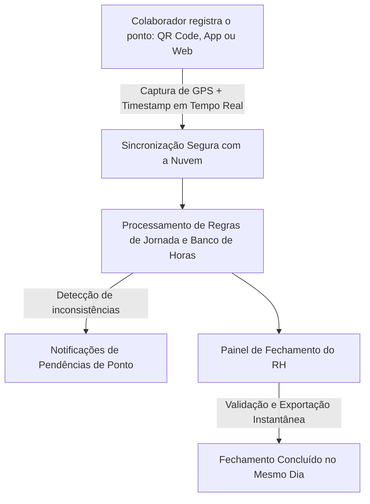

# Briefing de Produto: Sistema de Controle de Ponto Genial

---

## 1. Visão Geral e História de Criação
O **Genial** é uma plataforma digital e responsiva de controle de ponto e gestão de jornadas de trabalho, concebida para substituir fluxos manuais por automação segura. 

### O Contexto de Criação (Nascimento em 2017)
Criado em meados de **2017**, o Genial despontou como **um dos primeiros sistemas de controle de ponto digital do Brasil**. Antes de sua concepção, o fechamento mensal da folha de ponto na Rumo Soluções era um processo penoso e ineficiente: a gestora de RH passava dias inserindo e corrigindo marcações manualmente em planilhas Excel simples.

Para resolver essa dor, a equipe de engenharia converteu a lógica da planilha em um sistema web completo. **O que antes consumia vários dias de esforço de fechamento mensal passou a ser concluído no mesmo dia.** 

*   **Uso Atual:** Atualmente, a plataforma atua como ferramenta de uso **exclusivamente interno**, sustentando a gestão diária de jornada, banco de horas e frequência de toda a equipe de colaboradores da Rumo Soluções.

---

## 2. Promessa Básica e Proposta de Valor
> **"Feche a folha de ponto do mês em minutos, não em dias. Dê mobilidade ao seu colaborador e simplicidade absoluta ao seu RH."**

A proposta de valor do Genial reside em eliminar a burocracia do registro de ponto eletrônico, fornecendo uma interface simples de marcar para o funcionário e ferramentas consolidadas de fechamento automatizado para o administrador do RH.

---

## 3. Problemas Resolvidos pelo Sistema

*   **Sobrecarga de Fechamento de Folha:** Reduz drasticamente o tempo necessário para auditar, calcular e fechar as folhas de pagamento mensais (horas extras, banco de horas, faltas justificadas).
*   **Esquecimentos de Marcação (Furos de Ponto):** Mitiga a necessidade de correções manuais constantes ao notificar os colaboradores sobre possíveis marcações perdidas.
*   **Falta de Mobilidade e Trabalho Externo:** Resolve a dificuldade de registrar o ponto de equipes em home office ou atuando em campo através de marcações geolocalizadas no celular.
*   **Erros em Cálculos Manuais:** Elimina erros na soma de horas extras, adicionais noturnos e descontos de banco de horas decorrentes de fórmulas em planilhas sujeitas a falhas humanas.

---

## 4. Recursos e Funcionalidades Completas

### Módulos de Registro de Ponto:
*   **Marcação por QR Code:** O funcionário registra sua frequência aproximando seu QR Code individual da câmera de um dispositivo compartilhado pela equipe.
*   **Marcação Coletiva (por Lista):** Ideal para equipes alocadas juntas ou em campo, permitindo registrar a entrada de vários colaboradores rapidamente em uma lista única.
*   **Marcação Manual e Remota:** Registro individual diretamente pelo smartphone ou computador pessoal.
*   **Geolocalização Ativa:** Captura e armazena as coordenadas GPS de cada marcação de ponto, garantindo auditoria e conformidade nas rotinas de teletrabalho e campo.

### Painel Administrativo do RH (Web):
*   **Cálculo Automatizado de Horas:** Motor de cálculo instantâneo para banco de horas, saldo mensal, horas extras e faltas.
*   **Gerenciamento de Escalas e Turnos:** Cadastro de diferentes tipos de jornadas (comercial, plantões, escalas especiais).
*   **Aprovação de Ajustes e Justificativas:** Workflow para aprovação rápida de atestados médicos ou correções de furos solicitados pelos funcionários.
*   **Geração de Relatórios e Exportação:** Emissão de relatórios gerenciais consolidados em tempo recorde para integração direta com softwares de folha de pagamento.

### Funcionalidades do Colaborador:
*   **Consulta de Histórico:** Visualização em tempo real de suas marcações e saldos acumulados de horas.
*   **Notificações de Pendências:** Envio de alertas informativos para lembrar o colaborador de bater o ponto ou ajustar inconsistências.
*   **Canal com o RH:** Interface direta para enviar atestados de justificativa ou tirar dúvidas sobre o seu saldo de horas.

---

## 5. Como Funciona (Fluxo Operacional)

O ciclo de dados do ponto eletrônico no Genial funciona em três momentos integrados:

1.  **Registro:** O colaborador efetua o ponto. O sistema registra a geolocalização e a assinatura temporal da ação.
2.  **Sincronização:** Os dados são enviados à nuvem e processados conforme a escala e jornada configuradas.
3.  **Fechamento:** O gestor de RH visualiza um painel gerencial compilado, revisa apenas as pendências alertadas pelo sistema e aprova o fechamento do mês de maneira automatizada.

---

## 6. Diferenciais do Produto

*   **Pioneirismo no Mercado Nacional:** Concebido em 2017 como um dos primeiros sistemas digitais para desburocratização de ponto no país.
*   **Relação Simplicidade/Robusto:** Transpôs a intuitividade e facilidade visual de planilhas para a robustez de um sistema web estável e sem lentidão.
*   **Suporte Integrado com IA (Sófi):** Diferencial operacional interno onde colaboradores relatam erros de acesso ou solicitam suporte ao Genial diretamente pelo WhatsApp com a assistente Sófi, agilizando as correções pela equipe técnica.

---

## 7. Plataformas Disponíveis e Disponibilidade

*   **Plataformas:**
    *   **Acesso Web:** Painel completo para o RH e colaboradores gerenciarem ajustes no navegador (desktop ou mobile).
    *   **Aplicativo Móvel:** Disponível para sistemas **Android** (Google Play Store) e **iOS** (Apple App Store).
*   **Disponibilidade:** Operação contínua 24/7 hospedada em servidores cloud privados da Rumo Soluções, com controle de backup diário para segurança de dados.
*   **Stack Tecnológico:** Arquitetura Web responsiva de alta performance e bancos de dados seguros para registro transacional em tempo real.
