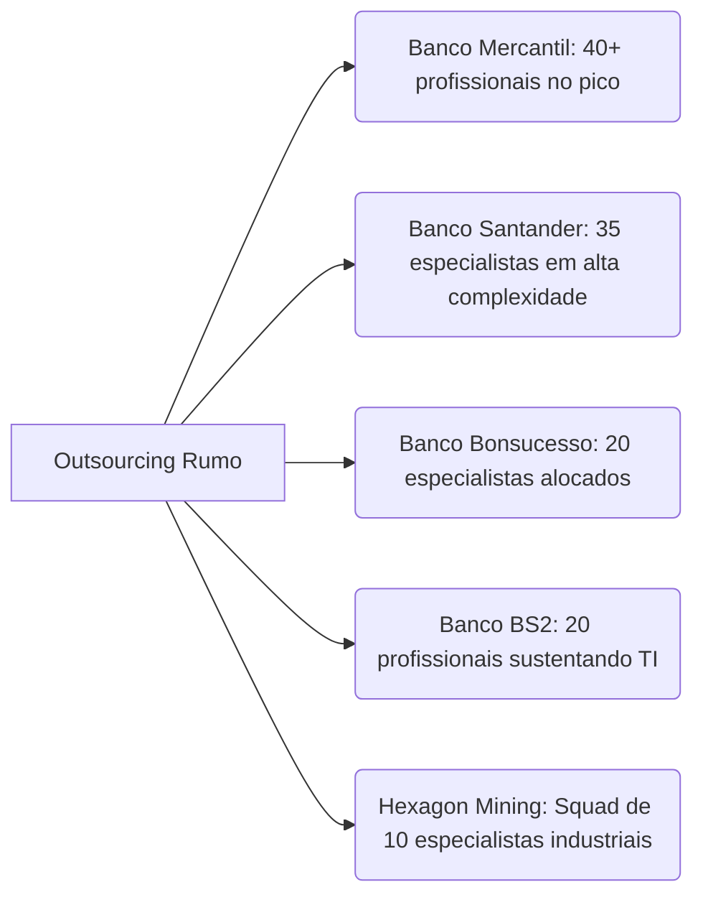

# Briefing de Negócios: Outsourcing de TI – Rumo Soluções

## 1. Visão Geral do Serviço
O **Outsourcing de TI da Rumo Soluções** é um serviço de alocação de profissionais e squads de tecnologia de alta performance, estruturado sob o pilar da **corresponsabilidade operacional**. Diferente de modelos tradicionais que se limitam à "terceirização de mão de obra" para cobrir demandas pontuais, a Rumo posiciona-se como parceira de continuidade tecnológica para empresas que não podem sofrer gargalos ou paralisações de sistemas.

Desde 2002, a Rumo atua nos bastidores de grandes players de mercado — especialmente nos setores financeiro (bancos e fintechs), seguradoras e indústrias —, sustentando operações críticas através da alocação de talentos rigorosamente qualificados.

---

## 2. Modelos de Contratação e Atuação

Para atender a diferentes dinâmicas corporativas, a Rumo oferece flexibilidade na composição de seus times:

### Modos de Alocação
*   **Alocação Individual:** Inserção de especialistas específicos (desenvolvedores, DBAs, arquitetos) para integrar e reforçar equipes internas já existentes.
*   **Squads Dedicadas:** Formação de equipes multidisciplinares completas (gerenciadas por Scrum Masters/Product Owners e compostas por desenvolvedores e analistas de QA) focadas na entrega de escopos fechados ou projetos específicos.

### Formatos de Contratos
*   **Contratos Fixos (Escopo Fechado):** Indicado para projetos com requisitos claros e cronogramas predefinidos.
*   **Sob Demanda (Time & Materials):** Cobrança baseada em horas consumidas, oferecendo máxima flexibilidade e adaptação a mudanças de prioridades técnicas.

### Modelos de Trabalho
*   **100% Remoto / Distribuído:** DNA de entrega remota consolidado, permitindo captar talentos em qualquer região sem perda de produtividade.
*   **Presencial ou Híbrido:** Atuação física nas dependências do cliente para demandas específicas que exijam proximidade geográfica ou compliance de segurança física.

---

## 3. Desafios de Mercado Solucionados pelo Outsourcing Rumo

*   **Falta de Mão de Obra Qualificada na Velocidade Exigida:** O tempo médio para recrutamento de profissionais seniores de TI é um gargalo para empresas tradicionais. A Rumo agiliza o tempo de alocação através de seu banco de talentos previamente validados.
*   **Custo de Turnover e Perda de Conhecimento:** Em um mercado de TI altamente volátil, a perda de um desenvolvedor no meio de um projeto causa atrasos milionários. A Rumo garante estabilidade operacional e baixíssimo turnover através de acompanhamento contínuo de performance e relacionamento estreito com os profissionais.
*   **Onboarding Complexo e Custo de Treinamento:** Contratar profissionais juniores e treiná-los consome tempo das equipes seniores do cliente. A Rumo fornece especialistas prontos e integrados no stack tecnológico exigido.
*   **Substituições Lentas (Cadeiras Vazias):** Caso um profissional precise se ausentar ou se desligar, a Rumo possui processos ágeis de substituição (*backups* técnicos) para garantir que a operação não sofra solavancos.

---

## 4. Portfólio de Perfis Técnicos e Stack Tecnológico

A Rumo sustenta operações de TI de ponta a ponta, oferecendo do perfil júnior ao sênior nas seguintes verticais:

### Perfis Alocados
*   **Desenvolvimento:** Engenheiros de software, DevOps, Arquitetos de sistemas, Desenvolvedores Front-end, Back-end e Mobile (iOS/Android), além de especialistas em RPA (Automação Robótica de Processos).
*   **Análise & Gestão:** Analistas de sistemas, analistas de testes (QA), especialistas em BI/Dados, Gerentes de Projetos, Scrum Masters e Agile Coaches.
*   **Infraestrutura:** Administradores de redes, administradores de bancos de dados (DBAs), especialistas em computação em nuvem (Cloud Specialists) e equipes de suporte técnico.

### Stack Tecnológico Dominado
*   **Linguagens e Frameworks:** Java, .NET Core, Python, JavaScript, PHP, Angular, React e COBOL.
*   **Bancos de Dados:** SQL Server, Oracle, IBM DB2, MySQL, MongoDB e PostgreSQL.
*   **Nuvem e Infraestrutura:** AWS, Google Cloud, Azure, Kubernetes, Docker e ambientes de servidores físicos (*on-premise*).

---

## 5. Casos de Sucesso e Credibilidade (Track Record)

O sucesso da metodologia de Outsourcing da Rumo é comprovado por parcerias de longo prazo que resistiram a crises macroeconômicas, mudanças de gestões corporativas e revoluções tecnológicas:

*   **Banco Mercantil:** Parceria mais duradoura da história da empresa, contando com mais de 40 profissionais alocados simultaneamente em seu pico de demanda.
*   **Banco Santander:** Alocação técnica de 35 especialistas seniores encarregados de demandas críticas e arquiteturas de alta complexidade.
*   **Banco Bonsucesso:** Time dedicado de 20 profissionais responsáveis por apoiar desde o desenho de novos projetos até a operação rotineira de infraestrutura.
*   **Banco BS2:** Consolidação de cerca de 20 especialistas na operação de TI, suportando a transformação digital da instituição financeira.
*   **Hexagon Mining:**Squad cirúrgica de 10 especialistas, expandindo o know-how de sistemas de missão crítica da Rumo para a indústria pesada e mineração.

---

## 6. Diferenciais Estratégicos e Técnicos da Rumo

*   **SLA de Missão Crítica:** Histórico comprovado de **taxa de erro inferior a 2% em mais de 70.000 demandas técnicas entregues** ao longo de duas décadas.
*   **Processo Seletivo com Validação Técnica Rigorosa:** A triagem dos candidatos inclui testes práticos e validações técnicas coordenadas por arquitetos e líderes técnicos experientes, eliminando contratações inadequadas.
*   **Baixíssimo Turnover:** Enquanto o mercado de tecnologia lida com trocas frequentes de profissionais, o método de gestão de pessoas da Rumo foca na retenção de talentos, garantindo a permanência do conhecimento do negócio no projeto do cliente.
*   **Transição Remota Natural:** Know-how consolidado em trabalho remoto desde antes de 2020, assegurando processos de onboarding e acompanhamento à distância altamente eficientes.
*   **Inovação Acelerada via IA:** A Rumo prepara e capacita seus profissionais alocados para construir, integrar e operar agentes inteligentes de Inteligência Artificial (focados em atendimento 24/7, precificação, BI, marketing preditivo, RH e segurança), acelerando a inovação dentro do cliente.
*   **Diagnóstico Gratuito:** Realização de uma avaliação inicial consultiva gratuita para mapear gargalos na infraestrutura de TI do cliente e sugerir o dimensionamento ideal dos profissionais requeridos.
